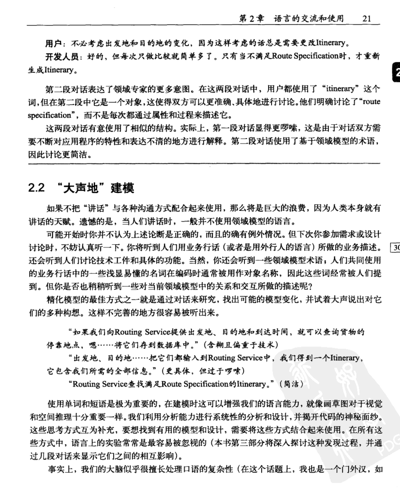
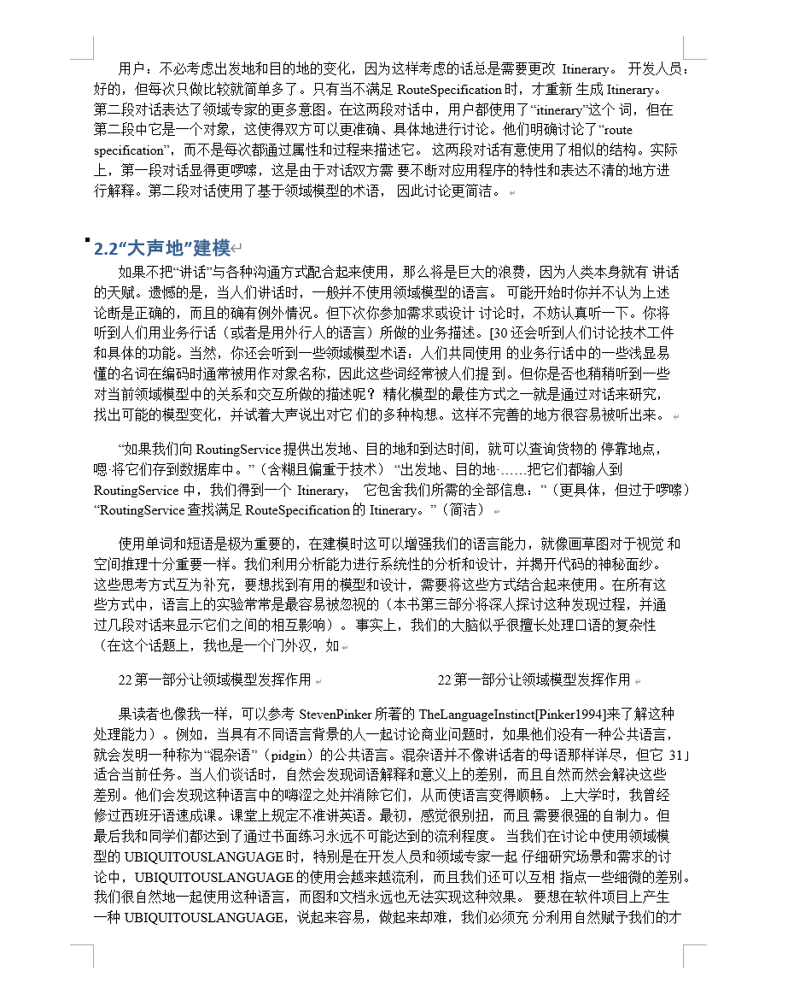
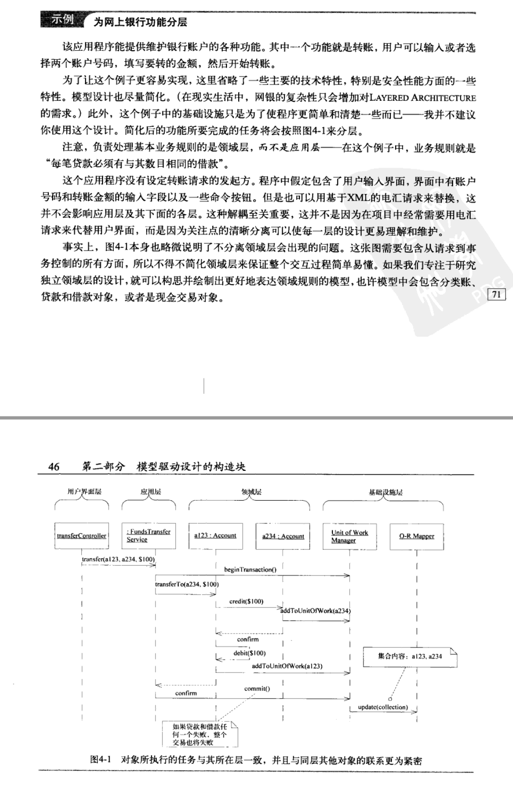
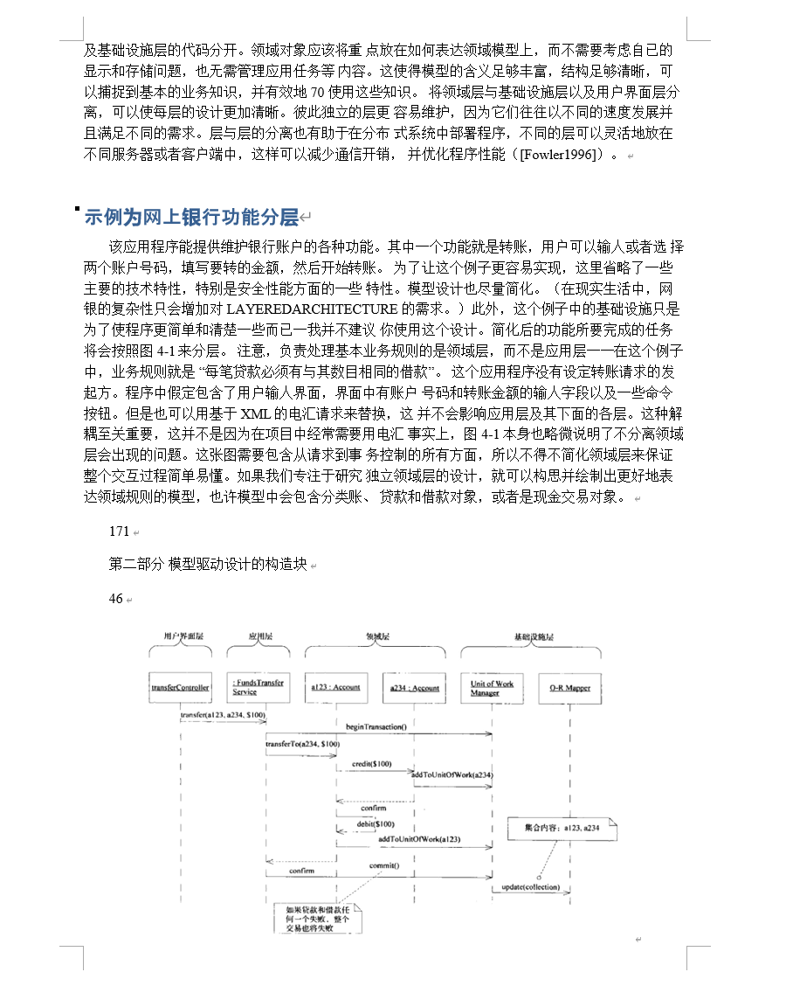
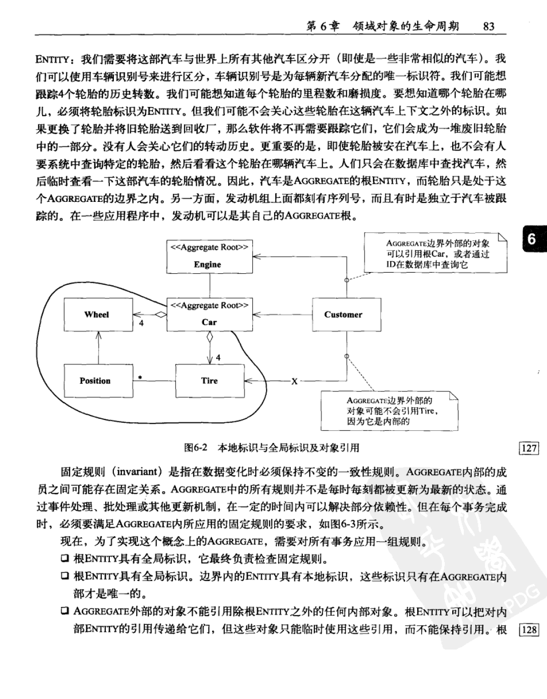
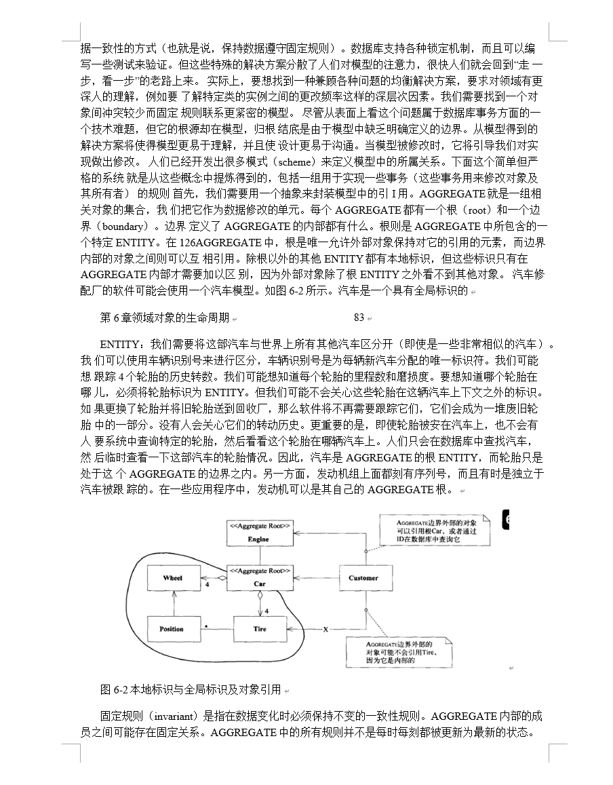

# PDF转换器（PDF Converter）

一款基于 PyQt6 的 Windows 桌面应用，将 PDF 文件批量转换为 Word（.docx）文档。支持普通 PDF 与扫描版 PDF：普通 PDF 保留排版与图片，扫描版在 `ocr_addon` 增强包存在时通过 PP-Structure OCR 直出分层可编辑 Word，否则自动降级为整页图片模式。

## 效果预览

以大部头扫描书《领域驱动设计：软件核心复杂性应对之道》（391 页）为例，扫描版 PDF 经 PP-Structure 版面分析 + OCR 还原为分层可编辑 Word 的前后对比：

| 原版 PDF | 转换后 Word |
| --- | --- |
|  |  |
|  |  |
|  |  |

## 功能特点

- **PDF 转 Word**：普通 PDF 使用 pdf2docx 转换，保留排版与图片
- **扫描版 PDF 支持**：自动检测扫描版，用 PP-Structure 版面分析 + OCR 直出分层可编辑 Word（可选 PaddleOCR），不可用时降级为整页图片模式
- **任务队列管理**：最多 20 个任务排队，串行逐个转换（底层库非线程安全，串行以保证稳定）
- **图片保留与修复**：保留 pdf2docx 生成的页面背景图并自动缩放到 Word 页面尺寸，避免图片显示不全/比例异常/与文字重叠；同时清理透明占位图与异常巨型浮动图
- **防覆盖保护**：输出文件同名时自动追加序号；重复任务自动去重
- **拖拽添加**：支持将 PDF 文件直接拖入窗口
- **协作式取消**：转换中可安全取消任务，退出时等待线程结束

## 技术栈

| 类别 | 技术 |
| --- | --- |
| 语言 | Python 3 |
| GUI | PyQt6 |
| PDF 转 Word | pdf2docx |
| PDF 解析 | PyMuPDF (fitz) |
| Word 处理 | python-docx |
| 图像处理 | Pillow |
| OCR（可选） | PaddleOCR + PaddlePaddle |
| 打包 | PyInstaller |

## 项目结构

```
pdf-converter/
├── src/
│   ├── main.py                  # 程序入口
│   ├── core/
│   │   ├── pdf_to_word.py       # PDF转Word核心（含扫描版检测/OCR/图片修复）
│   │   ├── single_task_worker.py# 单任务工作线程（QThread）
│   │   └── task_manager.py      # 任务队列调度（串行执行）
│   ├── models/
│   │   └── task_item.py         # 任务数据模型
│   └── ui/
│       ├── main_window_v2.py    # 主窗口
│       └── styles/              # 界面样式
├── resources/icons/             # 应用图标资源
├── tests/                       # 功能测试
├── ocr_addon/                   # OCR 增强包缓存（由 build_ocr_addon.bat 生成，gitignored）
├── PDFConverter.spec            # PyInstaller 打包配置
├── build.bat                    # 一键打包脚本（自动内含 ocr_addon）
├── build_ocr_addon.bat          # 构建 OCR 增强包脚本
└── requirements.txt             # 依赖清单
```

## 安装与运行

```bash
# 安装依赖
pip install -r requirements.txt

# 运行程序
python src/main.py
```

> 提示：开发环境下 PaddleOCR 为可选依赖，未安装时扫描版 PDF 将以图片模式转换。打包版本中扫描版 OCR 由 exe 同级的 `ocr_addon` 文件夹提供。

## 打包

```bash
build_ocr_addon.bat  # 构建 OCR 增强包（可选，首次需要；生成项目根 ocr_addon/，约 790MB）
build.bat            # 快速增量打包（保留缓存，自动内含已生成的 ocr_addon）
build.bat full       # 完整打包（安装依赖 + 清理缓存重新分析）
```

产物输出至 `dist\PDFConverter\` 目录（目录模式，启动无需自解压），分发时打包整个文件夹，双击其中 `PDFConverter.exe` 运行。

**OCR 增强包说明**：

- `ocr_addon` 是可选增强包，内含 `paddle/paddleocr` 依赖与中文离线模型，用于把扫描版 PDF 转换为可编辑文字。
- 运行 `build_ocr_addon.bat` 会在项目根生成 `ocr_addon/`（持久缓存，已加入 `.gitignore`，不进入版本库）。
- 运行 `build.bat` 或 `build.bat full` 时，会自动把项目根的 `ocr_addon` 复制到 `dist\PDFConverter\ocr_addon`。
- 因此最终交付物就是完整的 `dist\PDFConverter` 文件夹：内部已经包含 OCR 增强包，无需用户手动解压。
- 如果没有构建 `ocr_addon`，`build.bat` 也能完成打包，但会提示“ocr_addon not found”，此时扫描版 PDF 自动降级为整页图片模式。

## 测试

```bash
python tests/test_conversion.py
```

## 当前进度

**当前版本**：v1.0.0（正式发布）

### 已完成

- [x] 发布 v1.0.0 正式版（2026-08）：功能稳定，在 master 分支创建 annotated tag `v1.0.0` 作为首个正式版本里程碑；交付物为 `dist\PDFConverter` 完整目录（目录模式打包，已内含 OCR 增强包，分发时打包整个文件夹即可）
- [x] 修复普通 PDF 图片丢失/显示不全/图文重叠（2026-08）：pdf2docx 生成的整页背景图被误删或保持 20+ 英寸导致只显示左上角，现在保留并缩放到 Word 页面尺寸、定位到页面左上角，保持 behindDoc=1 置于文字下方
- [x] PDF 转 Word 核心功能（普通 / 扫描版自动识别）
- [x] 任务队列调度（20 任务上限、串行执行）
- [x] Word 文档图片修复（水印清理、异常浮动图处理、透明占位图删除、整页背景图缩放对齐）
- [x] Element Plus 风格 UI、拖拽添加、任务智能排序
- [x] PyInstaller 打包（目录模式）
- [x] 代码审查改进（2026-07）：
  - 修复跨线程取消竞争与 QThread 销毁崩溃（改为协作式取消 + finished 信号延迟清理）
  - 修复任务行号缓存失效导致的 UI 状态错位
  - 修复 inline 图片删除索引错位可能误删正常图片的问题
  - 修复 pdf2docx 转换参数未生效、扫描版转换资源泄漏
  - 新增任务去重与输出文件防覆盖保护
- [x] 移除 Markdown 转换功能（2026-07）：删除 pdf_to_markdown 模块及全部相关代码、依赖（pdfplumber）与打包配置
- [x] 移除输出格式选择入口，固定为 PDF 转 Word（2026-07）
- [x] 修复并发转换闪退（2026-07）：底层 pdf2docx/PyMuPDF/PaddleOCR 非线程安全，改为串行执行；新增 faulthandler + excepthook 崩溃日志（crash_log.txt）
- [x] 修复大文档转换整体闪退（2026-07）：定位到 PyMuPDF C 扩展在解析特定文档时 refcount 崩溃（Python 无法捕获）。将 pdf2docx 转换放入独立子进程隔离，子进程崩溃时主程序存活并将该任务标记为失败，不再拖垮整个应用
- [x] 修复队列统计计数错误（2026-07）：任务从等待队列转入运行集合时未发出 queue_updated 信号，导致"转换中"任务仍被界面计入等待中、运行中显示 0；在 _start_task 中补发队列状态刷新
- [x] 修复输出目录配置失效（2026-07）：输出目录在添加任务时快照，"先添加文件、后选目录"时已入队任务仍回退到源文件目录；现在选定新目录后自动同步到所有等待中任务，"打开输出目录"也优先使用任务实际输出目录
- [x] 优化打包与启动速度（2026-07）：打包改为目录模式（启动免自解压）、禁用 UPX、移出 PaddleOCR/paddle 及 pandas 等无用依赖（扫描版 PDF 降级图片模式）；pdf2docx 改为懒加载（开发环境导入耗时 0.47s→0.10s）；build.bat 默认增量构建（保留缓存/跳过依赖安装，full 参数完整构建）
- [x] 扫描版 PDF 升级为 PP-Structure 转换（2026-07）：替换原"基础 OCR 拼段落"逻辑，改用版面分析 + 阅读顺序恢复直出分层可编辑 docx（标题/正文/图片区域分层）；规避两个已知坑：表格模型与 paddlepaddle 2.6 不兼容（table=False）、cv2 中文路径静默失败（中间产物走 ASCII 临时目录）；无 paddle 环境仍自动降级图片模式，安装包不受影响
- [x] OCR 增强包分发方案（2026-07）：新增 build_ocr_addon.bat 构建独立 ocr_addon（pip --target 锁定版本 + 离线模型），主程序运行时检测 exe 同级 ocr_addon 并注入；解决三个冻结环境坑：paddle 按"site-packages"路径名定位原生库（依赖放 site-packages 子目录）、site.USER_SITE 为 None 导致 TypeError（运行时指向增强包）、paddle 所需标准库未被打入（spec 显式打入完整标准库闭包，主包仅增大约 2MB）；冻结环境端到端验证扫描版转换出可编辑文字通过
- [x] 转换日志透传 OCR 状态（2026-07）：扫描版检测、OCR 启用、降级原因（未找到增强包/依赖缺失/初始化失败）新增专用日志通道（converter log_callback → worker.log_message → task_manager.task_log → 界面转换日志），用户可直接看到扫描版为何输出图片而非文字
- [x] build.bat 自动内含 OCR 增强包（2026-07）：因 build.bat 每次重建会重建 dist\PDFConverter 导致内部 ocr_addon 副本丢失，构建成功后自动检测项目根 ocr_addon 并复制回 dist\PDFConverter\ocr_addon（不存在时提示跑 build_ocr_addon.bat），一条命令即得到带 OCR 的完整包
- [x] OCR 增强包缓存移出 dist（2026-07）：build_ocr_addon.bat 输出从 dist\ocr_addon 改为项目根 ocr_addon（持久缓存、已 gitignore），dist 目录下只保留唯一交付物 dist\PDFConverter（OCR 已内含）；最终交付只需打包 dist\PDFConverter 整个文件夹

### 待优化

> 以下为已记录、后续将作为重点处理的性能优化项（记录于 2026-09，具体根因以实测为准）。

- [x] **OCR 提速与 CPU 占用治理**（2026-09）：开启 MKLDNN 加速 CPU 推理、推理线程数对齐物理核（paddleocr 默认 MKLDNN 关闭）；OCR 整体移入独立子进程并设为低优先级（BELOW_NORMAL），转换满载时 GUI 与前台程序不再被拖垮，paddle 原生崩溃也不连累主程序（沿用 pdf2docx 子进程隔离模式）；MKLDNN 在部分 Windows CPU 上有原生崩溃风险，引擎初始化失败或子进程崩溃时自动降级为关闭 MKLDNN 重试一次，环境变量 `PDFCONVERTER_NO_MKLDNN=1` 可强制关闭；新增 OCR 耗时埋点（引擎初始化、页均推理耗时）。实测结论（i7-12700KF）：MKLDNN 在消费级 AVX2 CPU 上无收益（页均 2.0s 持平），已确认非有效杠杆；`rec_batch_num` 6→24（密集页批调度优化，识别结果不变）实测页均 2.07s→1.67s（-19%），已默认启用
- [x] **缩短大部头扫描书的 OCR 耗时**（2026-09 实测收官）：391 页大部头扫描书（领域驱动设计）OCR 从约 18-19 分钟降至 **11.5 分钟（页均 1.72s，-37%）**。手段：OCR 整体移入低优先级独立子进程（转换期间机器可用；空闲机器满速、前台有任务时主动让路导致变慢属预期行为）+ `rec_batch_num` 6→24（密集页批调度优化，识别结果不变）。实测结论存档：MKLDNN 在消费级 AVX2 CPU（i7-12700KF）上无收益；当前模型已是 PP-OCRv4 最轻的 mobile 档；页级多进程并行因 16GB 内存用户无法受益（单 worker 峰值约 2GB）而放弃。剩余可评估方向（未立项）：det 输入降档 960→736（微基准再 -13%，有小字号漏检风险）、onnxruntime/RapidOCR 路线（更省内存 + 甩掉约 600MB paddlepaddle 依赖，改造量约为独立小项目）
